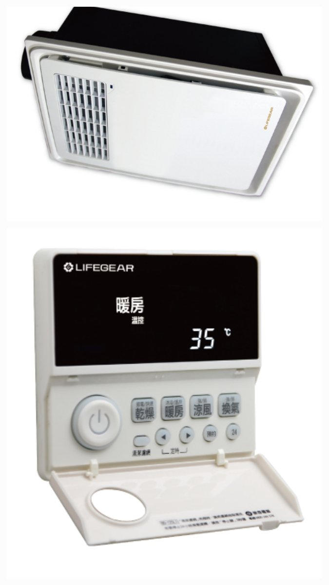
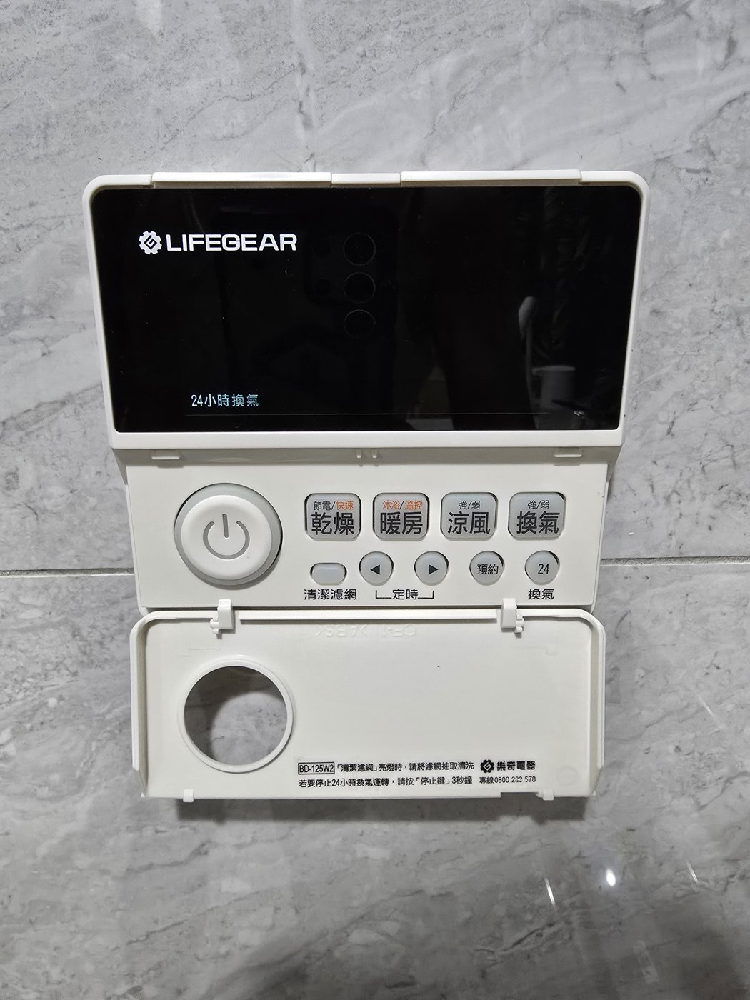
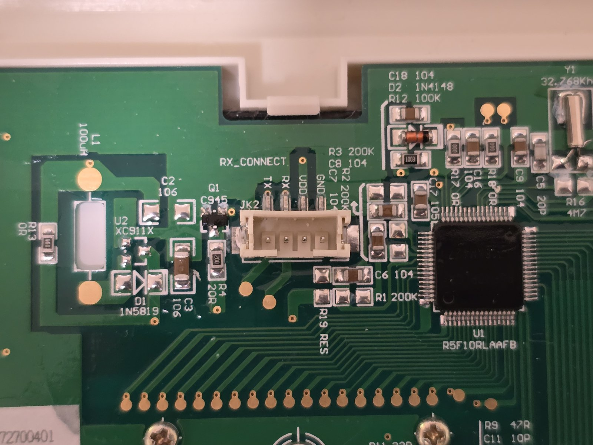
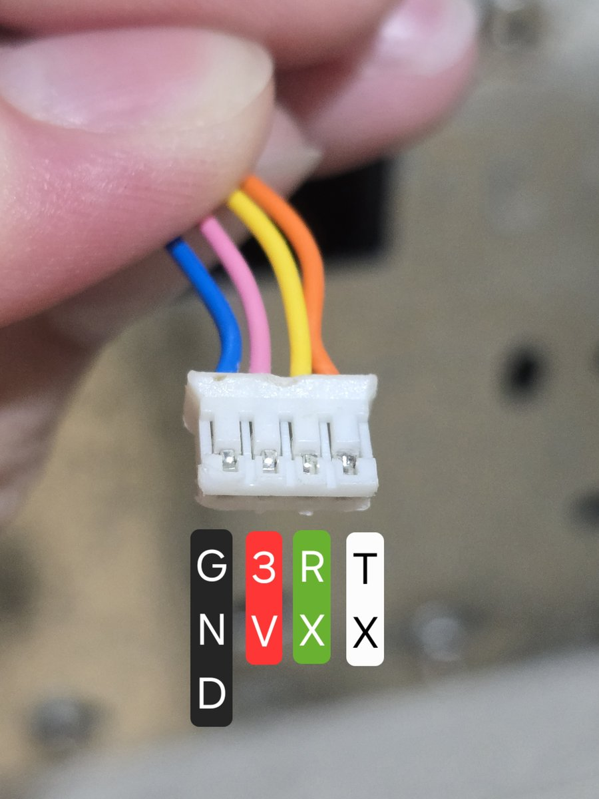
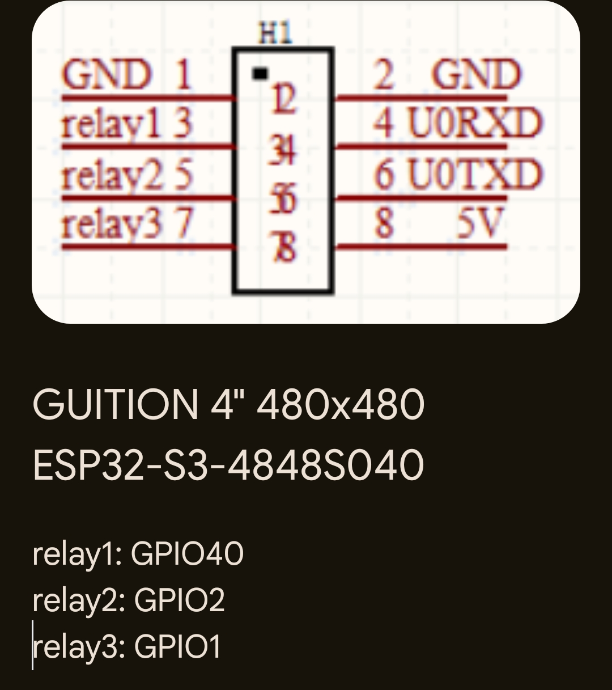
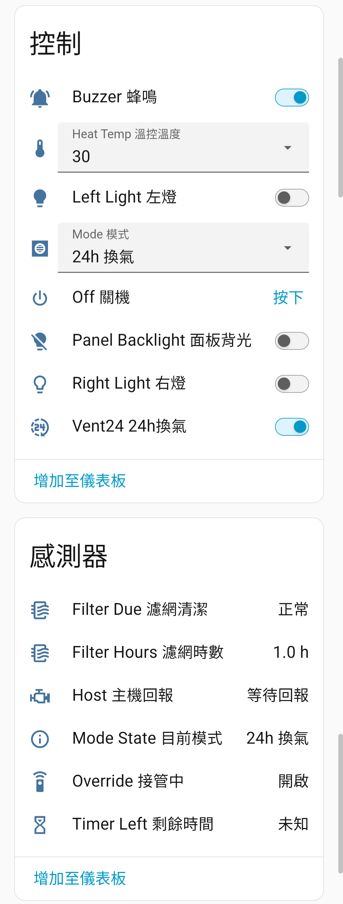

# ESPHome Lifegear 樂奇浴室暖風機

用一片 ESP32 取代樂奇（Lifegear）浴室暖風機的原廠有線面板，直接與暖風機主機通訊，把所有模式、照明、定時與濾網提醒整合進 Home Assistant。

這是一個 ESPHome [external component](https://esphome.io/components/external_components.html)，所有實體都由元件原生提供，設定檔裡不需要寫任何 lambda。協定由逆向工程取得，在 **BD-125W2** 實機運作。

另附一套 [Guition 4 吋觸控面板韌體](panel/README.md)，可以直接做出有螢幕的新面板。

<p align="center">
  
</p>

> [!WARNING]
> 暖風機是 220V 電器。拆裝面板與接線前，請先關閉該迴路的斷路器。本專案為非官方改裝，與樂奇電器無關，風險請自行評估。

## 功能

- **模式**：乾燥（節電／快速）、暖房（沐浴／溫控）、涼風（強／弱）、換氣（強／中／弱）、24 小時換氣、關機
- **暖房溫控溫度**：25–35 °C，非溫控模式下也能先設定，切進溫控時自動套用
- **照明**：左燈、右燈各自開關，並回報實際狀態
- **定時**：八個模式各自獨立的自動關機時間（5–720 分鐘），並回報剩餘時間
- **濾網**：累計運轉時數、清潔提醒門檻（720／1440／2160 小時）、重設
- **主機回報**：從主機送回的訊號解碼實際運轉狀態，不只是「送出了什麼」
- **按鍵音**：可選擇指令是否附帶主機的「嗶」聲
- **斷電記憶**：定時、溫控溫度、濾網門檻、24h 換氣、按鍵音等設定重開機後保留
- **顯示語言**：模式與狀態字串可選繁體中文或英文

## 支援硬體

| 項目 | 說明 |
|---|---|
| 暖風機 | BD-125W2 已實測。使用相同 4-pin 面板排線的其他樂奇機型可能相容，但未驗證 |
| ESP 晶片 | ESP32、ESP32-S3、ESP32-C3，需使用 `esp-idf` 框架 |
| ESPHome | 在 2025.11.5 開發與測試 |

## 接線

原廠面板背後有一組 4-pin 排針（JK2），主機透過一條排線接上來。拔掉原廠面板，把這條排線改接到 ESP32 即可。

<p align="center">
  
  
</p>

面板電路板上的絲印由左至右為 TX、RX、VDD、GND，是**面板的視角**：TX 是面板送往主機的線，RX 是主機送往面板的線。主機端排線的對應如下：

<p align="center">
  
</p>

| 排線 | 用途 | 接到 ESP32（範例） |
|---|---|---|
| GND | 地 | GND |
| 3V | 原廠面板的電源 | 可接ESP32的3V腳 |
| TX | 面板 → 主機 RX | GPIO19（`machine_tx_pin`） |
| RX | 主機 TX → 面板 | GPIO4（`rmt_rx_pin`） |

訊號為 3.3V 準位，可直接接 ESP32 GPIO。3V 腳的電流可以供電給 ESP32的3V。

但如果要使用Guition 4 吋 480×480 開發板則電流不足，無法推動面板。 排線顏色可能因批次不同，請以排針位置為準。

### 使用 ESP32-C3

把範例的 `esp32` 區塊換成 C3 即可，其餘設定不用改：

```yaml
esp32:
  variant: esp32c3
  board: esp32-c3-devkitm-1
  framework:
    type: esp-idf
```

C3 的 GPIO18／19 是 USB，腳位請改用其他 GPIO，例如 `machine_tx_pin: 3`、`rmt_rx_pin: 4`。

### 使用 Guition ESP32-S3-4848S040 觸控面板

如果想要一片有螢幕的面板取代原廠面板，本 repo 的 [`panel/`](panel/README.md) 提供完整的觸控面板韌體（畫面、操作說明與安裝方式都在該頁）。Guition 4 吋 480×480 開發板背面的 relay 排針就能直接接暖風機：

<p align="center">
  
</p>

| 排針 | GPIO | 接到排線 | 元件設定 |
|---|---|---|---|
| relay2 | GPIO2 | TX | `machine_tx_pin: 2` |
| relay3 | GPIO1 | RX | `rmt_rx_pin: 1` |
| GND | — | GND | — |

面板韌體與使用說明請見 [`panel/README.md`](panel/README.md)。

## 安裝

完整可編譯的範例在 [`example/lifegear-bath-heat.yaml`](example/lifegear-bath-heat.yaml)，複製後填入 `wifi_ssid` 與 `wifi_password` 兩個 secrets（格式見 [`example/secrets.yaml.example`](example/secrets.yaml.example)）即可燒錄。

最精簡的設定只需要：

```yaml
external_components:
  - source: github://xangin/esphome-lifegear-bath-heat@main
    components: [ lifegear_bath_heat ]

lifegear_bath_heat:
  id: bath_heat
  machine_tx_pin: 19   # → 排線 TX（主機 RX）
  rmt_rx_pin: 4        # ← 排線 RX（主機 TX）

select:
  - platform: lifegear_bath_heat
    lifegear_bath_heat_id: bath_heat
    mode:
      name: "Mode 模式"
```

## 設定選項

| 選項 | 必填 | 說明 |
|---|---|---|
| `machine_tx_pin` | 是 | ESP 送往主機的 GPIO，接排線 TX |
| `rmt_rx_pin` | 建議 | 接收主機訊號的 GPIO，接排線 RX。用 RMT 硬體擷取並解碼主機回報；不設就沒有主機實際狀態 |
| `display_language` | 否 | 模式與狀態字串語言：`zh-TW`（預設）或 `en` |
| `timer_defaults` | 否 | 八個模式的預設定時（分鐘，5–720）：`heat_bath`、`heat_temp`、`cool_high`、`cool_low`、`vent_high`、`vent_low`、`dry_eco`、`dry_fast`。宣告了對應的定時實體後，以 HA 上的設定值為準 |

## Home Assistant 實體

每個實體都是選擇性的：在對應平台底下宣告就會出現在 HA，不宣告就不會編進韌體。每個實體都能用 ESPHome 標準的 `name`、`id`、`icon`、`entity_category`、`disabled_by_default` 等選項。

<p align="center">
  
  <br>
  <sub>Home Assistant 裝置頁面。此截圖來自 Guition 觸控面板版，其中「面板背光」是面板本身的實體。</sub>
</p>

| 平台 | 項目 | 說明 |
|---|---|---|
| `select` | `mode` | 模式選擇：關機、各運轉模式、24h 換氣 |
| | `heat_temperature` | 暖房溫控溫度 25–35 °C |
| | `filter_threshold` | 濾網提醒門檻 720／1440／2160 小時 |
| `number` | `heat_bath_timer`、`heat_temp_timer`、`cool_high_timer`、`cool_low_timer`、`vent_high_timer`、`vent_low_timer`、`dry_eco_timer`、`dry_fast_timer` | 各模式定時（分鐘）；換氣中與換氣強共用 `vent_high_timer` |
| `switch` | `left_light`、`right_light` | 左燈、右燈 |
| | `buzzer` | 指令是否附帶主機按鍵音 |
| | `vent24` | 24h 換氣啟用 |
| `button` | `off` | 關機；24h 換氣啟用時改為進入 24h 換氣 |
| | `filter_reset` | 濾網清潔後歸零 |
| `sensor` | `filter_hours` | 濾網累計運轉時數 |
| | `timer_left` | 定時剩餘分鐘 |
| `text_sensor` | `current_mode` | 目前模式 |
| | `host_status` | 主機回報：關機、運轉中、24h 換氣、等待回報 |
| | `raw_state` | 原始狀態位元（診斷用） |
| `binary_sensor` | `filter_due` | 濾網需要清潔 |
| | `left_light_state`、`right_light_state` | 左燈、右燈實際狀態 |

## 行為說明

- **開機保護**：上電後 15 秒內收到的控制指令不會被丟掉，會暫存最後一道，保護解除後自動送出。開機時預設送「關機」狀態。
- **24h 換氣**：關機狀態下啟用會立即進入 24h 換氣；其他模式運轉中啟用不會打斷，定時到了改回 24h 換氣。停用時若正處於 24h 換氣會立即關機。開機還原設定時不會送出任何指令。
- **定時**：切進有定時的模式即開始倒數，時間到自動關機（24h 換氣啟用時改回 24h 換氣）。運轉中修改定時會以新值重新起算。
- **暖房溫控溫度**：協定裡沒有獨立的溫度欄位，每個溫度都是一組完整的模式碼，所以溫度會先存成偏好值，切進暖房溫控時才送到主機；溫控運轉中修改則立即生效。
- **主機回報**：八個運轉模式在收到主機有效訊號後回報「運轉中」；關機與 24h 換氣需主機明確確認。連續 10 秒沒有收到主機訊號會回到「等待回報」。
- **濾網時數**：只在實際運轉時累計，節流寫入 NVS 以保護 flash。

## English

An ESPHome external component that replaces the wired wall panel of a Lifegear bathroom heater/ventilator (tested on BD-125W2) with an ESP32, talking to the heater's main unit directly. Every Home Assistant entity is provided natively by the component — no lambdas needed: mode select (dry, heat, cool, vent, 24h ventilation, off), heat set-point (25–35 °C), both lights, per-mode auto-off timers, filter runtime reminders, and the machine's decoded actual state.

Wire the 4-pin panel cable to an ESP32, ESP32-S3 or ESP32-C3 (esp-idf): cable **TX** → `machine_tx_pin`, cable **RX** → `rmt_rx_pin`, common GND, and power the ESP separately. See [`example/lifegear-bath-heat.yaml`](example/lifegear-bath-heat.yaml) for a complete configuration; for ESP32-C3 just swap the `esp32` block and avoid the USB pins GPIO18/19. Developed against ESPHome 2025.11.5. Display strings are selectable with `display_language: en`.

This is an unofficial, reverse-engineered project and is not affiliated with Lifegear. Mains voltage is involved — switch off the breaker before opening anything.

## 授權

程式碼以 [MIT License](LICENSE) 釋出。產品照片版權屬樂奇電器所有，僅用於識別機型。
