# Guition 4 吋觸控面板

用 Guition ESP32-S3-4848S040（4 吋 480×480 觸控開發板）做一片新的暖風機面板，直接取代原廠有線面板。四大模式、定時、濾網、Wi-Fi 設定都在觸控畫面上完成，同時整合 Home Assistant。

面板建立在本 repo 的 [`lifegear_bath_heat`](../README.md) 元件上，暖風機的通訊與實體都由元件提供，這個資料夾只負責畫面與操作。

  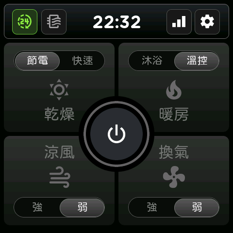

## 功能

- **四大模式卡**：乾燥、暖房、涼風、換氣各一張卡，運轉中的卡片亮起模式顏色，卡上的滑塊記住各模式最後選的段位
- **中央電源鈕**：關機時是電源圖示；運轉中變成剩餘時間倒數，外圈跟著模式變色，冒號閃爍代表倒數進行中
- **狀態列**：24h 換氣、濾網、時鐘、Wi-Fi、設定
- **設定頁**：定時、設定、資訊三個分頁，離開時統一確認是否儲存
- **面板上直接選 Wi-Fi**：掃描清單加上螢幕鍵盤，不需要手機
- **離線可用**：沒有 Wi-Fi、沒有 Home Assistant 都能完整操作，也不會因此重開機
- **螢幕睡眠**：可設定閒置關閉螢幕，以及「首次觸控僅喚醒」避免誤按

介面文字為繁體中文。

## 硬體與接線

面板背面的 relay 排針可以直接接暖風機的 4-pin 排線，排線定義見[主頁的接線說明](../README.md#接線)。

  

| 排針 | GPIO | 接到排線 |
|---|---|---|
| relay2 | GPIO2 | TX |
| relay3 | GPIO1 | RX |
| GND | — | GND |

面板本身請用開發板的 USB 5V 供電，與暖風機排線共地；排線上的 3V 腳不要接。

## 安裝

1. 把整個 `panel/` 資料夾複製到你的 ESPHome 設定目錄。
2. 編譯並燒錄 [`lifegear-bath-heat-panel.yaml`](lifegear-bath-heat-panel.yaml)。第一次請用 USB 燒錄，之後可以 OTA 更新。

不需要任何 secrets：韌體出廠不帶 Wi-Fi 設定，開機後在面板上設定即可。字型在編譯時由 ESPHome 從官方來源自動下載，所以編譯時需要網路。

裝置名稱預設為 `lg-bath-pannel` 加上 MAC 後綴，要改名就改檔案開頭 `substitutions` 裡的 `devicename`。各模式的預設定時在 `lifegear_bath_heat` 區塊的 `timer_defaults`。

## 第一次連上 Wi-Fi

1. 點狀態列的 **Wi-Fi 圖示**（未連線時為紅色），開啟網路彈窗。
2. 按「**選擇網路**」，清單會依訊號強弱列出附近的 Wi-Fi，每 2 秒自動更新。
3. 點選要連的網路，用螢幕鍵盤輸入密碼後按「**連線**」。顯示「已連線」就完成了，設定會永久保存。

連不上會顯示「連線失敗」，可以直接重新輸入。隱藏 SSID 的網路不會出現在清單裡，這種情況請改用手機連面板的熱點：未連網時面板會廣播與裝置名稱相同的熱點，密碼 `12345678`，連上後會自動跳出設定頁（沒有跳出就用瀏覽器開 `192.168.4.1`）。

要換網路時，已連線狀態下原本的按鈕會變成「**重設網路**」，確認後會清除目前連線並回到掃描清單。

## 操作說明

### 模式

- **啟動**：點一下模式卡，以卡上滑塊目前的段位啟動。
- **切換段位**：運轉中再點同一張卡，就在兩段之間切換；也可以直接點滑塊的左右兩側。
- **切換模式**：直接點另一張卡。倒數會先顯示 `--:--`，收到新模式的剩餘時間後再開始倒數，代表切換確實生效。
- **關機**：點中央電源鈕。若 24h 換氣已啟用，關機後會自動轉入 24h 換氣。
- **定時到**：自動關機（24h 換氣啟用時改回 24h 換氣）。

  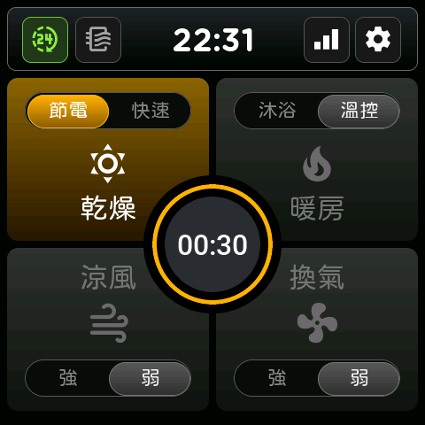
  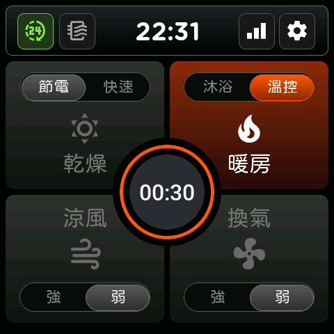
  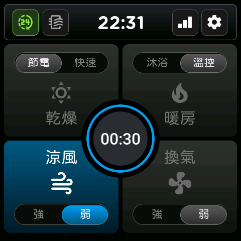
  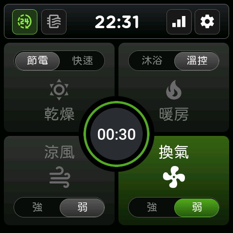

### 狀態列

| 圖示 | 顏色 | 操作 |
|---|---|---|
| 24h 換氣 | 綠＝開啟、灰＝關閉 | **長按 2 秒**切換開關；短按會提示「請長按兩秒」 |
| 濾網 | 紅＝需要清潔 | 點一下開啟濾網彈窗 |
| 時鐘 | 未連線顯示 `--:--` | — |
| Wi-Fi | 白＝Wi-Fi 與 HA 都正常、紅＝任一未連線 | 點一下開啟網路彈窗 |
| 設定 | — | 點一下進入設定頁 |

時鐘由 Home Assistant 同步，沒有連上 HA 時不會顯示時間。

### 濾網

濾網彈窗顯示累計運轉時數，並可用左右鍵在 720／1440／2160 小時之間選擇提醒門檻，超過門檻時狀態列的濾網圖示轉紅。清潔完濾網後按「重置」，確認後歸零。改了提醒時數再按關閉，會詢問是否儲存。

  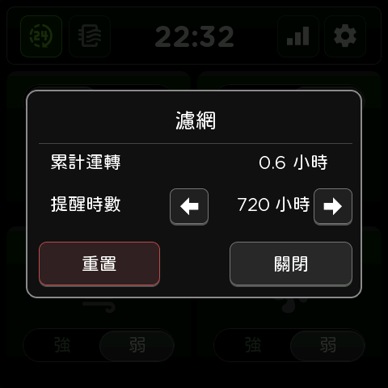
  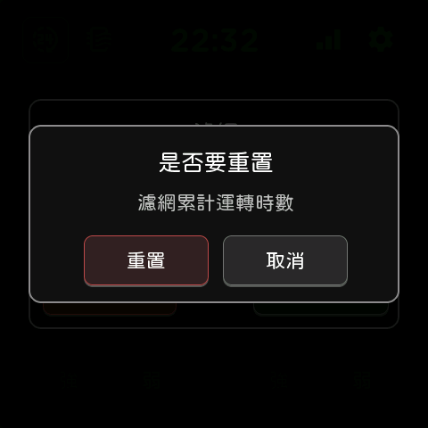

### 設定頁

點狀態列的齒輪進入，下方分「定時、設定、資訊」三個分頁。有未儲存的改動時，按返回會詢問「儲存並返回／不儲存／取消」。閒置超過「自動回首頁」的時間會自動返回主畫面，有未儲存的改動時同樣先詢問。

- **定時**：八個模式各自的自動關機時間，分兩頁，用右側箭頭翻頁。範圍 10–720 分鐘，每按一次增減 10 分鐘。
- **設定**：
  - 螢幕亮度：10–100%，拖動時即時生效
  - 螢幕睡眠：閒置多久關閉螢幕（不關閉到 30 分鐘）
  - 首次觸控僅喚醒：睡眠中第一下觸控只點亮螢幕，不觸發按鈕
  - 自動回首頁：設定頁閒置多久自動返回主畫面
  - 溫控溫度：暖房溫控的目標溫度，25–35 °C
  - 主機蜂鳴音：暖風機主機的操作提示音
- **資訊**：主機狀態、目前模式、面板版本、開機時間。

  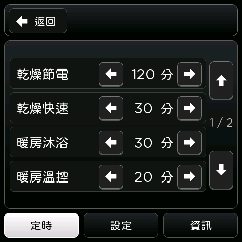
  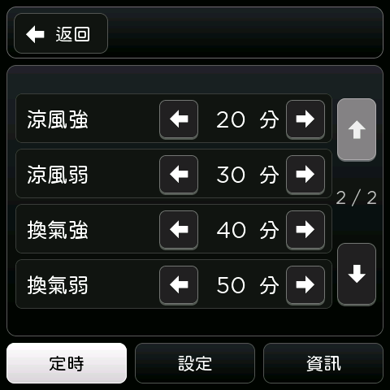
  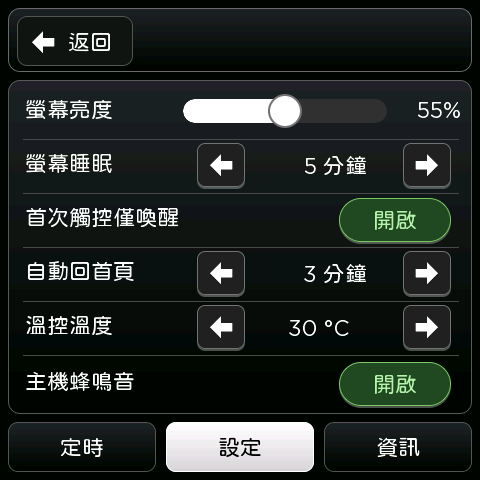

  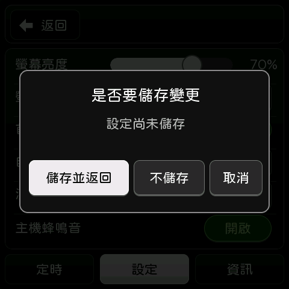
  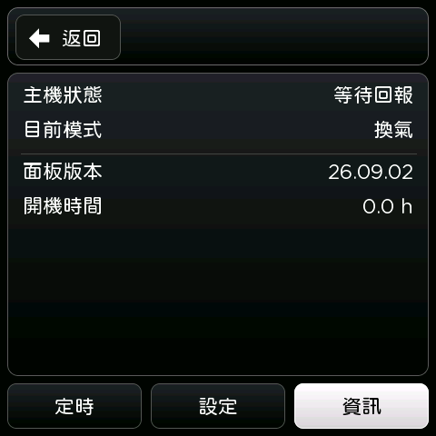

截圖為作者機器上的實際畫面，英數字型與本 repo 的版本略有不同。

## 字型

repo 內不附任何字型檔，編譯時由 ESPHome 從下列來源下載，各字型依其原專案授權：

| 字型 | 來源 | 用途 |
|---|---|---|
| jf-openhuninn 2.1 | [justfont/open-huninn-font](https://github.com/justfont/open-huninn-font) | 中文 |
| Material Design Icons 7.2.96 | [Templarian/MaterialDesign-Webfont](https://github.com/Templarian/MaterialDesign-Webfont) | 圖示 |
| Nunito | [Google Fonts](https://fonts.google.com/specimen/Nunito) | 時鐘、設定頁英數 |
| Roboto | [Google Fonts](https://fonts.google.com/specimen/Roboto) | 中央倒數 |
